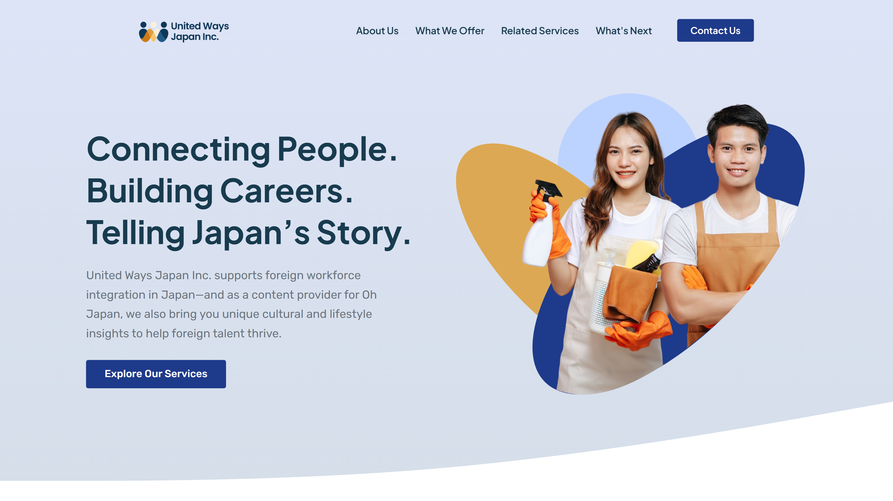

# United Ways Japan Inc. | Foreign Workforce Integration Portal

[](https://unitedwaysjapaninc.vercel.app/)

## 📱 Project Preview
<p align="center">
  
</p>

## 🚀 The Problem & Solution
**The Problem:** Foreign residents and job seekers in Japan often face significant hurdles due to cultural gaps and complex workplace etiquette. United Ways Japan needed a professional website to deliver valuable resources and cultural insights that could help international talent thrive and businesses grow.

**The Solution:** I developed a content-rich website that serves as a bridge for the international community. By integrating real-life stories, expert guides, and practical advice into a clean, accessible UI, the platform empowers users to navigate Japanese life and workplace culture with confidence.

---

## 🛠️ Tech Stack & Tools
* **Frontend:** HTML5, CSS3, JavaScript (ES6+)
* **Framework:** Tailwind CSS (Responsive Layouts)
* **Content Strategy:** Integrated lifestyle and workplace insights for "Oh Japan"
* **UI/UX Design:** Figma (Focused on accessibility and readability)
* **Deployment:** Vercel

---

## ✨ Key Features
* **Cultural Resource Hub:** Specialized sections for workplace culture and everyday living tips.
* **Responsive Storytelling:** Optimized layouts for long-form articles and "real-life" community stories.
* **Information Architecture:** A clean, structured navigation system designed to make complex immigration and integration advice easy to find.
* **Business Growth Insights:** Resources tailored for Japanese businesses looking to integrate international talent effectively.

---

## 📂 Project Structure
```text
├── assets/             # Cultural photography and brand icons
├── css/                # Custom stylesheets for high-readability
├── js/                 # Interactive UI components
├── guides/             # Structured resource folders
└── index.html          # Main landing portal
